<h2>Tensorflow-Image-Segmentation-BraTS2021-Brain-Tumor (2024/02/18)</h2>

This is an experimental Image Segmentation project for BraTS2021-Brain-Tumor based on
the <a href="https://github.com/sarah-antillia/Tensorflow-Image-Segmentation-API">Tensorflow-Image-Segmentation-API</a>,
and 
<a href="https://drive.google.com/file/d/1gyLoQcMA6t9_jlSDY0YzVXf8UZn56H3D/view?usp=sharing">
BraTS21-ImageMask-Dataset.zip
</a> created from the master dataset of 
<a href="http://braintumorsegmentation.org/"><b>RSNA-ASNR-MICCAI Brain Tumor Segmentation (BraTS) Challenge 2021</b></a>
 
 
As a first trial, we use the simple UNet Model 
<a href="./src/TensorflowUNet.py">TensorflowSlightlyFlexibleUNet</a> for this BraTS21-Brain-Tumor Segmentation. 
As shown in <a href="https://github.com/sarah-antillia/Tensorflow-Image-Segmentation-API">Tensorflow-Image-Segmentation-API</a>.
you may try other Tensorflow UNet Models: 

<li><a href="./src/TensorflowSwinUNet.py">TensorflowSwinUNet.py</a></li>
<li><a href="./src/TensorflowMultiResUNet.py">TensorflowMultiResUNet.py</a></li>
<li><a href="./src/TensorflowAttentionUNet.py">TensorflowAttentionUNet.py</a></li>
<li><a href="./src/TensorflowEfficientUNet.py">TensorflowEfficientUNet.py</a></li>
<li><a href="./src/TensorflowUNet3Plus.py">TensorflowUNet3Plus.py</a></li>
 

<h3>1. Dataset Citation</h3>
The dataset used here has been taken from Task1 (Segmentation) dataset of the following website. 

<b>RSNA-ASNR-MICCAI Brain Tumor Segmentation (BraTS) Challenge 2021</b> 

http://braintumorsegmentation.org/ 

<pre>
The RSNA-ASNR-MICCAI BraTS 2021 challenge utilizes multi-institutional pre-operative baseline 
multi-parametric magnetic resonance imaging (mpMRI) scans, and focuses on the evaluation of 
state-of-the-art methods for (Task 1) the segmentation of intrinsically heterogeneous brain 
glioblastoma sub-regions in mpMRI scans. 
Furthemore, this BraTS 2021 challenge also focuses on the evaluation of (Task 2) classification 
methods to predict the MGMT promoter methylation status.

Data Usage Agreement / Citations
You are free to use and/or refer to the BraTS datasets in your own research, 
provided that you always cite the following three manuscripts: 

[1] U.Baid, et al., "The RSNA-ASNR-MICCAI BraTS 2021 Benchmark on Brain Tumor 
Segmentation and Radiogenomic Classification", 
arXiv:2107.02314, 2021(opens in a new window). 

[2] B. H. Menze, A. Jakab, S. Bauer, J. Kalpathy-Cramer, K. Farahani, J. Kirby, et al. 
"The Multimodal Brain Tumor Image Segmentation Benchmark (BRATS)", 
IEEE Transactions on Medical Imaging 34(10), 1993-2024 (2015) 
DOI: 10.1109/TMI.2014.2377694 (opens in a new window) 

[3] S. Bakas, H. Akbari, A. Sotiras, M. Bilello, M. Rozycki, J.S. Kirby, et al., 
"Advancing The Cancer Genome Atlas glioma MRI collections with expert segmentation 
labels and radiomic features", Nature Scientific Data, 4:170117 (2017) 
DOI: 10.1038/sdata.2017.117(opens in a new window)
</pre>
 
Please see also kaggle.com website <a href="https://www.kaggle.com/datasets/dschettler8845/brats-2021-task1">BRaTS 2021 Task 1 Dataset</a> 

<h3>
<a id="2">
2 BraTS21 ImageMask Dataset
</a>
</h3>
 If you would like to train this BraTS21-Brain-Tumor Segmentation model by yourself,
 please download the simplified <b>BraTS21-Subset ImageMask Dataset</b> from the google drive 
<a href="https://drive.google.com/file/d/1gyLoQcMA6t9_jlSDY0YzVXf8UZn56H3D/view?usp=sharing">
BraTS21-ImageMask-Dataset.zip
</a>
 
<b>
Please note that this ImageMask-Dataset has been created from the following two types of NIfTI files.
</b> 
<pre>
flair.nii.gz : fluid-attenuated inversion recovery MR images
seg.nii.gz   : segmentation images 
</pre>
 
Please see also the <a href="https://github.com/atlan-antillia/BraTS21-ImageMask-Dataset">BraTS21-ImageMask-Dataset</a>. 
Please expand the downloaded ImageMaskDataset and place them under <b>./dataset</b> folder to be

<pre>
./dataset
└─BraTS21
    ├─test
    │  ├─images
    │  └─masks
    ├─train
    │  ├─images
    │  └─masks
    └─valid
        ├─images
        └─masks
</pre>
 
 
<b>BraTS21 Dataset Statistics</b> 
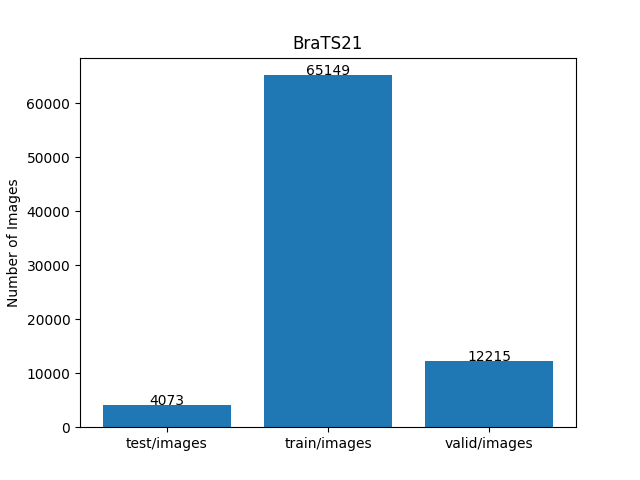 

 

<h3>
<a id="3">
3 TensorflowSlightlyFlexibleUNet
</a>
</h3>
This <a href="./src/TensorflowUNet.py">TensorflowUNet</a> model is slightly flexibly customizable by a configuration file. 
For example, <b>TensorflowSlightlyFlexibleUNet/BraTS21</b> model can be customizable
by using <a href="./projects/TensorflowSlightlyFlexibleUNet/BraTS21/train_eval_infer.config">
train_eval_infer.config.</a>
<pre>
; train_eval_infer.config
; 2024/02/16 (C) antillia.com

[model]
model          = "TensorflowUNet"

image_width    = 256
image_height   = 256
image_channels = 3
num_classes    = 1
base_filters   = 16
num_layers     = 8
dropout_rate   = 0.08
learning_rate  = 0.0001

loss           = "bce_iou_loss"
;loss           = "binary_crossentropy"
metrics        = ["binary_accuracy"]
show_summary   = False

[train]
epochs        = 100
batch_size    = 4
patience      = 10
metrics       = ["binary_accuracy", "val_binary_accuracy"]

model_dir     = "./models"
eval_dir      = "./eval"

image_datapath = "../../../dataset/BraTS21/train/images/"
mask_datapath  = "../../../dataset/BraTS21/train/masks/"

[eval]
image_datapath = "../../../dataset/BraTS21/valid/images/"
mask_datapath  = "../../../dataset/BraTS21/valid/masks/"

[infer] 
images_dir    = "./mini_test/"
output_dir    = "./mini_test_output"
merged_dir    = "./mini_test_output_merged"

[mask]
blur      = True
binarize  = True
threshold = 76
</pre>

<h3>
3.1 Training
</h3>
Please move to a <b>./projects/TensorflowSlightlyFlexibleUNet/BraTS21</b> folder, 
and run the following bat file to train TensorflowUNet model for BraTS21. 
<pre>
./1.train.bat
</pre>
<pre>
python ../../../src/TensorflowUNetTrainer.py ./train_eval_infer.config

</pre>
Train console output: 
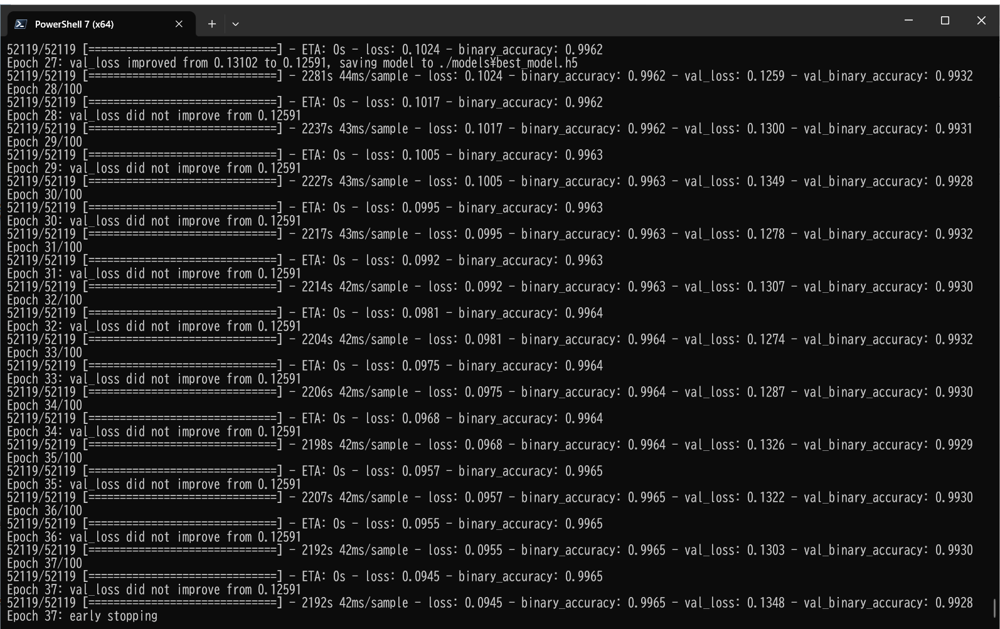 
Train metrics: 
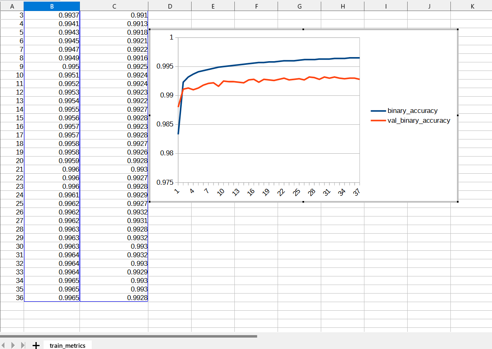 
Train losses: 
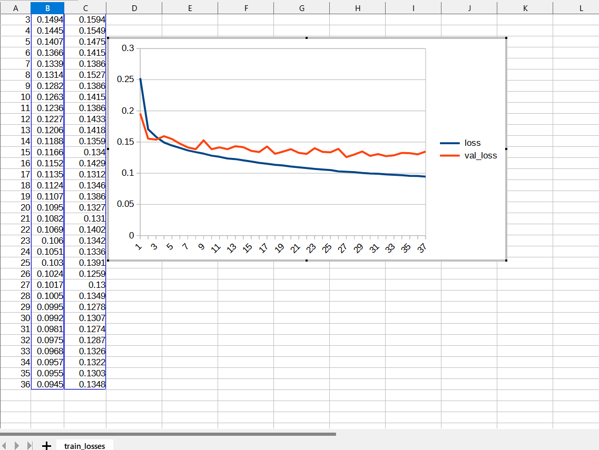 
 
The trained model (h5) file is too large to include in this repository as shown below. 

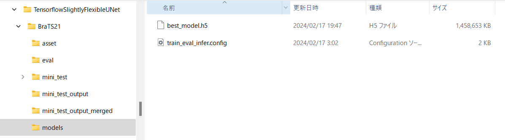 

However, if you would like to use it for your experiment, you can download the trained model from the google drive 
<a href="https://drive.google.com/file/d/1m3OnVkpexFDkLZC-Em-2wEFNEHGO0cG-/view?usp=sharing">BraTS21_Brain_Tumor_models.zip</a> 
 

<h3>
3.2 Evaluation
</h3>
Please move to a <b>./projects/TensorflowSlightlyFlexibleUNet/BraTS21</b> folder, 
and run the following bat file to evaluate TensorflowUNet model for BraTS21. 
<pre>
./2.evaluate.bat
</pre>
<pre>
python ../../../src/TensorflowUNetEvaluator.py ./train_eval_infer.config
</pre>
This evaluates loss and accuracy for images and masks in <a href="../../../dataset/BratTS/eval">BratTS/eval</a> folder.  
Evaluation console output: 
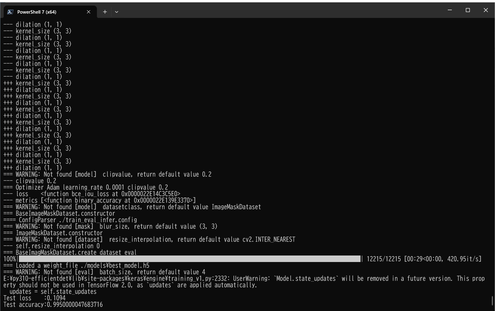 

<h2>
3.3 Inference
</h2>
Please move to a <b>./projects/TensorflowSlightlyFlexibleUNet/BraTS21</b> folder 
,and run the following bat file to infer segmentation regions for images by the Trained-TensorflowUNet model for BraTS21. 
<pre>
./3.infer.bat
</pre>
<pre>
python ../../../src/TensorflowUNetInferencer.py ./train_eval_infer.config
</pre>
This infers Brai-Tumor regions for images in <a href="./projects/TensorflowSlightlyFlexibleUNet/BraTS21/mini_test">mini_test</a> folder.

Sample test images 
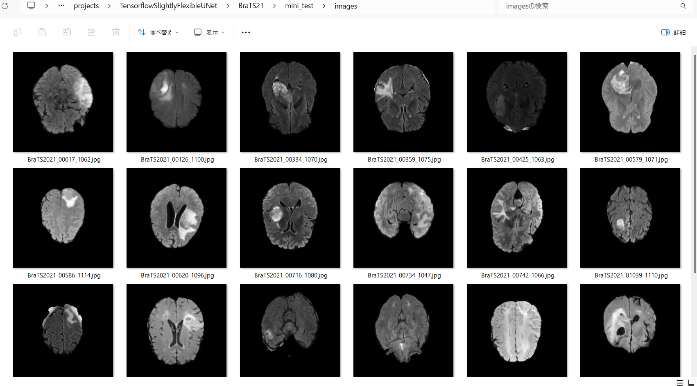 
Sample test mask (ground_truth) 
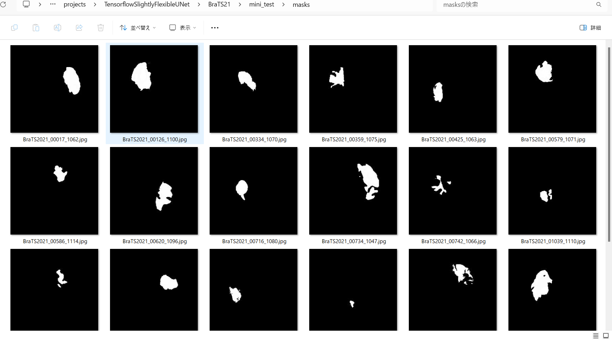 

 
Inferred test masks 
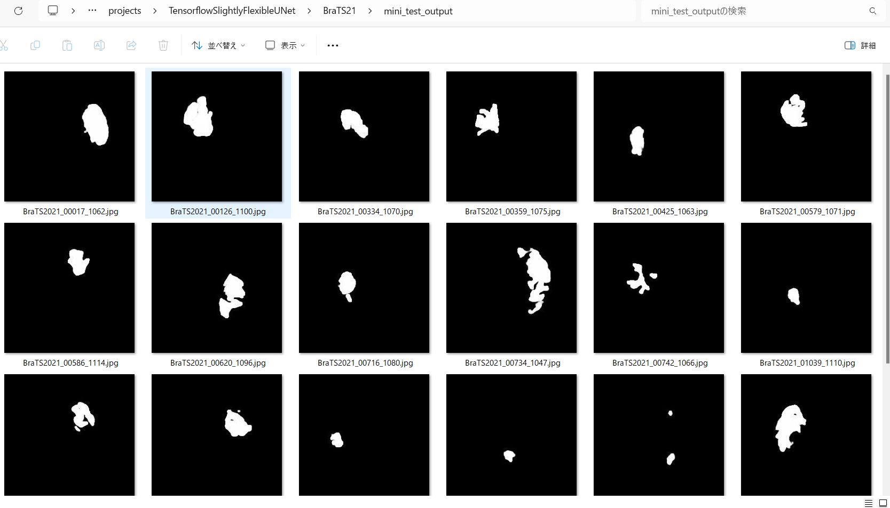 
 
Merged test images and inferred masks  
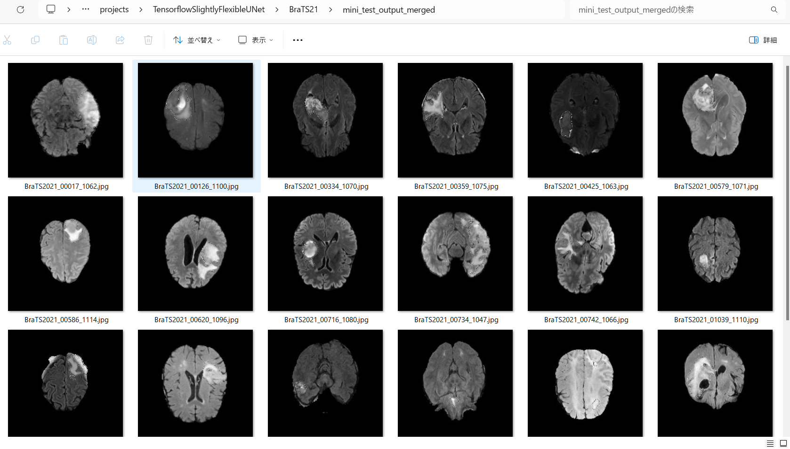  

Enlarged test-images and inferred-merged-images 
<table>
<tr>
<td>test/images/BraTS2021_00017_1062.jpg</td>
<td>Inferred BraTS2021_00017_1062.jpg</td>
</tr>

<tr>
<td>

</td>
<td>
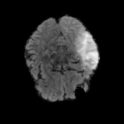
</td> 
</tr>

<!-- 2-->
<tr>
<td>test/images/BraTS2021_00334_1070.jpg</td>
<td>Inferred BraTS2021_00334_1070.jpg</td>
</tr>

<tr>
<td>
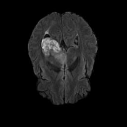
</td>
<td>
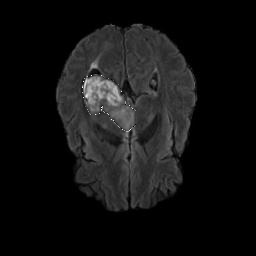
</td> 
</tr>

<!-- 3-->
<tr>
<td>test/images/BraTS2021_00579_1071.jpg</td>
<td>Inferred BraTS2021_00579_1071.jpg</td>
</tr>

<tr>
<td>

</td>
<td>
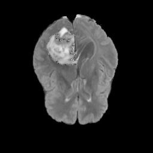
</td> 
</tr>

<!-- 4-->
<tr>
<td>test/images/BraTS2021_00716_1080.jpg</td>
<td>Inferred BraTS2021_00716_1080.jpg</td>
</tr>

<tr>
<td>
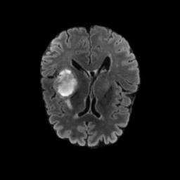
</td>
<td>

</td> 
</tr>

<!-- 5-->
<tr>
<td>test/images/BraTS2021_01073_1119.jpg</td>
<td>Inferred BraTS2021_01073_1119.jpg</td>
</tr>

<tr>
<td>

</td>
<td>
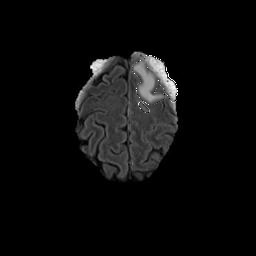
</td> 
</tr>

<!-- 6-->
<tr>
<td>test/images/BraTS2021_00734_1047.jpg</td>
<td>Inferred BraTS2021_00734_1047.jpg</td>
</tr>

<tr>
<td>
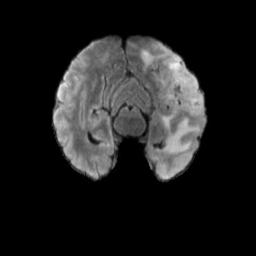
</td>
<td>
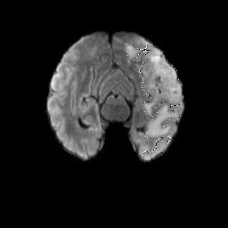
</td> 
</tr>

</table>

<h3>
References
</h3>
<b>1. RSNA-ASNR-MICCAI Brain Tumor Segmentation (BraTS) Challenge 2021</b> 
<pre>
http://braintumorsegmentation.org/
</pre>

<b>2. BRaTS 2021 Task 1 Dataset</b> 
<pre>
https://www.kaggle.com/datasets/dschettler8845/brats-2021-task1
</pre>

